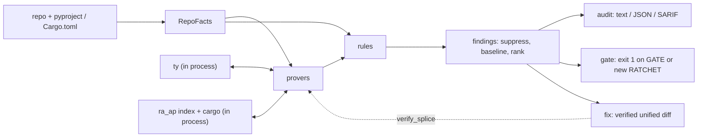

# Architecture

Sightline is an agent-ergonomics checker with one product flow:

1. **Facts.** A repository becomes one `RepoFacts` per language: syntax trees,
   symbol, reference, call-site, import and class indexes, comments, and the
   inputs that are not source (entry points, the declared type-check scope).
   No opinions, no oracle.
2. **Provers.** Analysis over facts: the type-checker oracle, the call graph,
   effects, the closed world, liveness, clones, counterfactual worlds.
3. **Rules.** Thin queries over facts and provers. Each yields `Finding`s.
4. **Findings.** Engine stamped from evidence, tier from engine, then suppress,
   then baseline diff, then rank.
5. **Verbs.** `audit` renders, `gate` blocks, `fix` emits a diff.

## Vocabulary

The words this document and `benchmarks.md` use as terms.

| Term | Meaning |
| --- | --- |
| Arm | One shape a rule reports, named in the finding's slug suffix. A rule's precision is judged per arm where the arms differ. `explain` calls an arm's rows its findings |
| Family | What a rule prices, one of six words: trust, surface, context, perf, tests, checker |
| Tier | How the finding was proved: proved, indexed or heuristic. Each tier has a precision bar |
| Posture | What `gate` does with a rule: GATE blocks, RATCHET blocks what is new against the baseline, REPORT never blocks |
| Scope | Which gate runs a rule: a `file` rule reads one file and runs in the fast gate, a `repo` rule needs the whole tree |
| Shape | The digest of a symbol's body the baseline keeps beside its name, so a rename or a move keeps its allowance |
| Corpus | The six public repositories `crates/xtask/corpus.toml` pins, audited by every measurement |
| Clean repository | The corpus repository per language that a blocking rule must stay silent on. A GATE rule that fires there is demoted |
| Held-out repositories | Public repositories drawn by seed for one round and never read to tune a rule. Also called the gauntlet |
| Round | One judged measurement: a manifest of held-out repositories, a seed, and hand verdicts on a sample of findings |
| Judged sample | The `tp` of `n` findings a round read at their sites, in `crates/core/data/precision.toml` |
| Restriction | A narrowing of a rule's arms, accepted when it removes three or more judged false positives per true positive lost |
| Retired id | A rule cut on its measured precision. Its id is never reused, and `explain <id>` prints why it was cut |
| Trail | `corpus-ext/decisions.tsv`, the append-only record of every cut, restriction and retirement with its evidence |
| World | An in-memory edit of the tree the oracle re-checks, to verify a fix |
| Splice | One exact edit set in one file, the unit a world verifies |

## What each verb asks the pipeline for

[docs/reference.md](docs/reference.md) lists the verbs and their flags. This is
what each one costs.

| Verb | Facts | Oracle |
| --- | --- | --- |
| `audit` | Repo-wide | Diagnostics, edges, types |
| `gate` | One file per changed file | Off |
| `gate --full` | Repo-wide | Diagnostics, edges, types |
| `fix` | Repo-wide | One more worlds pass |
| `facts QNAME` | Repo-wide | One worlds pass over that symbol's findings |

Three subset rulings hold. The fast gate runs the `scope = "file"` rules on
single-file facts and reports a subset of the full audit. A degraded run
(`oracle = false`, an environment that does not resolve, a checker panic, a
module decoded lossily) reports a subset of its full twin. In both cases the
provenance header names every silence: a disabled or degraded prover is never
skipped without a word.

## Crates

Ten crates, and the fences between them are crate boundaries, so a `use` that
crosses one is a compile error rather than a convention.

| Crate | One responsibility |
| --- | --- |
| `core` | Everything language-blind: config, findings, suppress, rank, ratchet, the four renderers, precision data, the rule record and registry, the `Stack` and `Repo` seam, the discovery walk, git, patches and edits, worlds, clone mining, the complexity score, comment predicates, the catalog vocabulary, Tarjan SCC |
| `py-facts` | Build `RepoFacts` for Python once. One traversal per module fills the parent map, the enclosing map and a dense node index; module qnames are path logic; an import hop is a LOAD on the alias |
| `py-provers` | All Python analysis, and the only code that talks to the ty oracle. An oracle-backed accessor answers empty, never absent, when the oracle is off |
| `py-rules` | The Python `@rule` functions and the Python `Stack` |
| `rs-facts` | The same contract for Rust, over tree-sitter |
| `rs-provers` | All Rust analysis, and the only code that runs a Rust toolchain |
| `rs-rules` | The Rust rule functions and the Rust `Stack` |
| `sightline` | The binary, published as `sightline-lint`: the verbs, the pipeline that collects a run, and the version line |
| `testkit` | Inline mini-repository fixtures for every crate's tests. Dev-only |
| `xtask` | The workspace's own tooling. `cargo xtask check` is the gate |

Three modules inside the provers crates are named because they are single
answers everything else routes through. `py-provers/src/scope.rs` is the one
place a function body is read. `py-provers/src/callgraph.rs` is the one answer
to "what body runs", class hierarchy analysis re-judged by oracle callee edges.
`py-provers/src/catalog.rs` is the one table of what an external call does, and
every consumer projects from it: the effects fold, #59's spend, #41's shapes,
#9's import-time mutators.

`py-rules/src/framework.rs` is the one home for "this signature is mandated by
a base, a dispatch protocol or a consumer".

## The fences

A rules crate lists no parser and no oracle crate in its `Cargo.toml`. It reads
tree-sitter's `Node` through a `rs_facts::Node` re-export, so it never names the
parser. `cargo xtask fence` proves three things:

- The direct dependencies of `sightline-py-rules` and `sightline-rs-rules`,
  read from `cargo metadata`, include no `ruff_python_parser`, `ty_*`,
  `tree-sitter*`, `ra_ap_*` or `cargo_metadata`. The check reads direct
  dependencies rather than `cargo tree`, which would always show `ty_*` through
  the provers.
- No source line of either rules crate names one of those crate paths, and no
  provers crate re-exports one.
- The clippy `disallowed-methods` and `disallowed-types` lists pass on both
  rules crates. Those lists sit in a `clippy.toml` beside each rules crate, and
  they are what keeps I/O out of a rule: `std::fs`, `std::process::Command`,
  `std::env` and `std::io::stdin`. The parser entry points are caught by the
  source grep above, since clippy warns about a disallowed path no dependency
  of the crate holds.

`#![deny(dead_code)]` in each rules crate is what turns a rule constant the
`RULES` list forgot into a build error.

## Language seam

One `Stack` per source language, and `detect(root)` picks the stacks a root
runs. A `Cargo.toml` anywhere the walk reaches marks Rust, so a tree whose
crates sit below the root marks it too. A `pyproject.toml` or a `setup.py`
anywhere marks Python; `.py` files alone leave Python loose. The marked
languages run. Where none is marked the loose ones run, and where none is
loose either Python runs, so an empty tree still reports a header. A loose
language beside a marked one is a stray script: it does not run, and the
header says so.

The walk is language-neutral and belongs to no stack: `discover` lists the
auditable files once and each stack indexes the suffix it owns.

The verbs iterate the stacks and concatenate their findings before suppress,
baseline diff and rank, so the ranked report is one list. Past the rules
everything is language-blind and reads a facts view through the neutral
attributes every facts type fills.

| Attribute | Shape | Read by |
| --- | --- | --- |
| `modules` | qname to module, module has `qname`, `rel`, `lines` | Header, rollup |
| `module_by_rel` | rel to module | Suppress, rollup |
| `symbols` | qname to symbol, symbol has `lineno`, `end_lineno`, `kind` | JSON span, rollup |
| `doc_files` | rel to lines | Suppress, for the HTML marker |
| `errors` | strings | Header, gate notes |
| `languages` | names | Header |
| `fan_in` | module qname to inbound cross-module references | Rollup |
| `cc_prior(qname)` | integer | Rank |
| `is_test(rel)` | bool | Rollup |
| `comment_prefix(rel)` | `#` or `//` | Suppress |

A rule's record declares its language. One registry holds both languages'
rules, and the run filters by it. A Rust reading keeps its Python sibling's id
and slug, so `rules-off`, suppression and baseline keys mean the same thing in
both languages. Posture belongs to the reading, so `gate` and the SARIF level
ask for the posture of an id in a language: a reading no precision round has
judged reports while its sibling ratchets.

## Naming boundary

**Engine, then tier.** Prover machinery stamps a finding's engine from its
evidence, and a rule never sets either field. `counterfactual` and `oracle` are
**proved**. `wp` (call graph, effects, closed world) and `idx` (repo-wide
indexes) are **indexed**. `oracle-ungrounded` and `ast` are **heuristic**.
Proved rests only on claims the repository wrote, meaning an annotation it
declared. Inference by the checker alone never grounds a proved finding.

**Scope** is `file` or `repo`. `scope = "file"` promises that single-file and
repo-wide facts agree. Any reach past the rule's own file, such as a base chain
or another module's alias, makes the rule repo-scope however local it looks.

**Splice and world.** A splice is one exact edit set in one file plus the
spelling it must import. It never shifts a line, so a deletion blanks. A world
is an in-memory source override the oracle re-checks. Its veto is a *new*
error-severity diagnostic in the watched files, and a deletion owned by a
module watches every file, because such a splice has no dependents to
enumerate. `verify_splice` is the one path from a rule to a world.

**Closed world.** A definition is closed when every caller is a call the graph
shows. The closed-world prover fails closed on every escape that holds:
published, re-export, reference, kwargs, override, framework base, unknown
decorator, reflection. `published` is the packaging read, which a config key
overrides. A library's callers are downstream, so no in-repo caller set is
complete for one.

**Shipped subset.** A production module-scope list of source-file names, two or
more of which name repository modules, is a set the repository copies as a unit
into a runtime of its own. A hoist may not add an import edge out of a set that
holds the hoisting module.

## Ordering is a contract

Two audits of one tree on one machine are identical byte for byte, at one
thread and at every core. Three mechanisms hold that.

Facts passes run per module under rayon and merge in discovery order. Rules run
under rayon in one group, each reading memoized accessors and a cloned salsa
snapshot, then #5, #10 and the fix emitters run in sequence, because a world
takes the database by mutable reference. Findings concatenate in registry order
and one total order sorts them: a lower bound on the measured chance the
finding is real (the posterior mean of the judged sample less one standard
deviation, so five of five sits under two hundred of two hundred and twenty),
then position within the rule, then the complexity prior, then location, then
rule id. Tier is provenance, not a sort key.

Provenance notes would otherwise record which thread reached a lazy accessor
first, so each note-producing accessor keeps its notes in its own cell and the
header concatenates the cells in a fixed order.

`cargo xtask check` cross-checks one thread against every core on two corpus
repositories.

## Oracle boundary

Neither oracle is a subprocess of Sightline's own protocol. Both run in
process, and nothing outside the provers crates reaches either.

**Python.** `py-provers/src/oracle.rs` builds a `ty_project::ProjectDatabase`
from the fork pinned in the workspace manifest: extra paths, excludes, the
Python environment, and six rules at warning level. It answers diagnostics
through `db.check()`, callee edges through `callee_definitions`, span types
through `covering_node`, module-scope reveals through the semantic model, and
worlds by overriding source text and re-checking the watched files. A checker
panic is caught at the oracle boundary and degrades the run with a header note
rather than ending it.

The fork's contribution is pyright's `reportUnnecessary*` family, body-inferred
returns, callee edges with an `external` verdict, and every error-severity
diagnostic passed through. That last one is what arms the veto: a shim that
dropped an error-severity diagnostic would disarm every counterfactual check
without a word.

A verify pass lands every splice in one merged world first and group-tests the
rest for the verdict an isolated world would give. The vetoed set splits on the
evidence: a member whose own body hosts an added error is isolated, one world
clears the rest, and the set splits in two only where no body names the error.
The split is language-neutral and lives once in `core`, over four attributes of
a proposal and three of a diagnostic. Each language brings its overlay builder
and its checker.

**Rust.** `rs-provers/src/oracle/` loads the workspace once per project root
through `ra_ap_load-cargo`, with proc macros and build scripts on, and resolves
each call site at the callee identifier's byte offset through `hir::Semantics`.
A resolved target maps to a facts symbol by relative path, definition line and
name. `cargo metadata` and `cargo check --workspace --all-targets --offline
--keep-going` stay subprocesses, parsed as JSON, and supply the base
diagnostics and the worlds.

A member whose base check errors on this host is `unchecked`: the header names
it, it enters no world, and it sits outside the closed world. A crate whose
code sits behind non-default features resolves few edges, and the header's
`call_edges` count is how a reader tells.

## Rule families

`sightline explain <id>` prints one rule's whole record, its arms and its
measured precision. The record on the function is the only home for that.

| Family | Ids | Home | What it prices |
| --- | --- | --- | --- |
| **trust** | 1-3, 5-10, 33, 40, 49, 50, 53 | `trust.rs`, `returns.rs` | Declared contracts against what callers prove. #5 lifts and #10 widens, both through worlds |
| **surface** | 11, 12, 14, 18, 20, 21, 23, 37, 48, 54, 55 | `surface.rs`, `idioms.rs`, mining in `core` | Clones, idioms, clumps, folds, complexity. #11's block groups are the maximal repeats of a suffix array over per-statement blind digests |
| **context** | 24, 26-29, 32, 34-36, 38, 39, 56, 57, 59, 60 | `context.rs`, `imports.rs`, `dead.rs`, `comments.rs`, `records.rs` | What a reader must ingest, module topology, and weight that nothing ships |
| **perf** | 41 | `perf.rs`, hot set from `hotness.rs` | Catalog shapes inside the hot set alone. Each entry ships a micro-benchmark proving 2x or better |
| **tests** | 42, 44, 47 | `tests_quality.rs` | Binary structural shapes. A verdict is what mutation testing counts |
| **checker** | 58 | `oracle_errors.rs` | Live type errors and possibly-unbound reads, forwarded and never derived again. The claim is the checker's, so every such finding is ungrounded and REPORT |

What another linter already covers is stated on the rule record and printed by
`explain`: ruff F822 for #32's `__all__` names, ruff PERF for #41's cold glue,
the ty rule set for #58.

## Persistent state

| Location | Meaning |
| --- | --- |
| `.sightline-baseline` | RATCHET keys, counts and shapes, the only posture written; one line per key |
| `sightline.toml` | This repository's own config |
| `crates/core/data/precision.toml` | Measured precision and recall per rule and arm. Compiled into the binary, so a release answers `explain` with no checkout |
| `crates/sightline/data/retired.toml` | The rows of the trail that retire an id, extracted by `cargo xtask retired` |
| `crates/xtask/corpus.toml` | The corpus table: name, root, config, language, role, and the commit the recorded measurements were taken at. Every measurement command reads it and no second list |
| `corpus/`, `corpus-ext/` | Corpus configs and the profile pin; the judged sheets, reports and the trail, described in `corpus-ext/README.md` |

## Quality protocol

Precision is sampled per tier against a seed pinned before judging. The bars
are 95% for proved, 80% for indexed and 70% for heuristic. A round that fails
yields restrictions, each accepted at three or more judged false positives
removed per true positive lost, and then a fresh seed. A GATE rule that fires
on a clean repository is demoted, and suppression is never the answer.

Rules and metrics are never tuned against corpus results to force an expected
ordering. A cut is measured on both sides, precision and recall, or it does
not happen.
